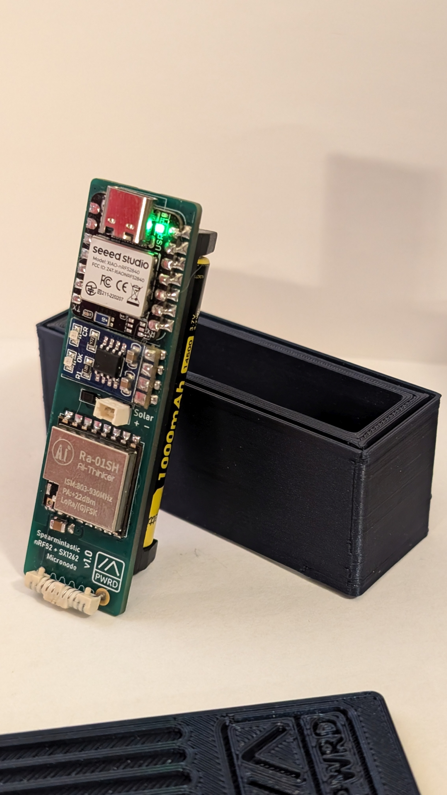
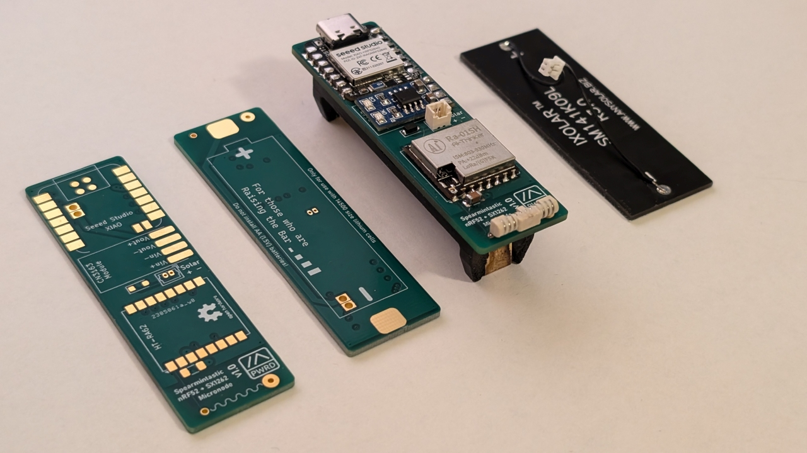
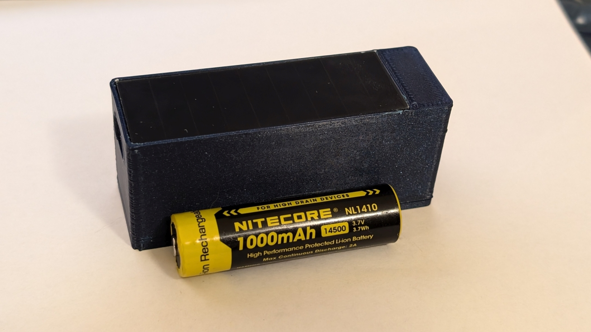
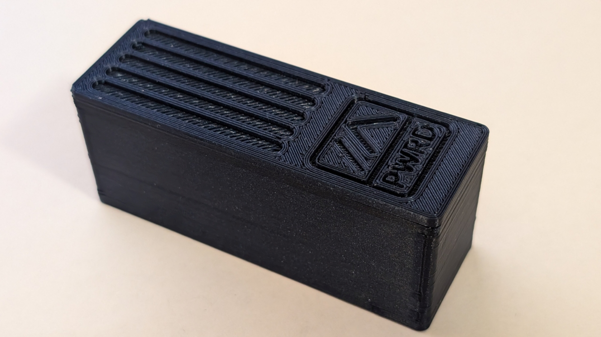

# Spearmintastic!
## Self-sufficient, pocket sized
**Spearmintastic** is a pocket-sized device designed for use as Meshtastic node. Unlike most other tiny node designs, it is designed to be fully self sufficient (including battery, solar panel, and LoRa antenna) in a footprint no larger than its 21x71mm PCB.

**Spearmintastic** uses a "14500" (AA) size protected Li-ion battery, minimizing fears about sketchy pouch cells from Amazon or AliExpress. These can be found via online retailers as "flashlight batteries".

## Errata Notes:

- Solar polarity silkscreen is reversed on v1.0 board

## Bill Of Materials

| Part | Spec | Qty | Link |
|--|--|--|--|
| PCB | Spearmintastic v1.0 | 1 | This repository! |
| Microcontroller | Seeed Studio XIAO nRF52840 | 1 | [DigiKey](https://www.digikey.com/en/products/detail/seeed-technology-co-ltd/102010448/16652893) |
| LoRa Radio | Ai-Thinker Ra-01SH ***or*** Heltec HT-RA62 | 1 | [Ra-01SH](https://www.aliexpress.us/item/3256802374880132.html) or [HT-RA62](https://www.aliexpress.us/item/3256805259034353.html) |
| Solar Charger | SD05CRMA (CN3163 Breakout) | 1 | [AliExpress](https://www.aliexpress.us/item/3256805359874309.html) |
| Antenna | Pulse W3139 | 1 | [DigiKey](https://www.digikey.com/en/products/detail/pulse-electronics/W3139/9817201) |
| Solar Panel | ANYSOLAR SM141K09L | 1 | [DigiKey](https://www.digikey.com/en/products/detail/anysolar-ltd/SM141K09L/9990465) |
| Solar Panel Pigtail | 2x wire, 1.25mm PicoBlade termination | 1 | [DigiKey](https://www.digikey.com/en/products/detail/molex/0151340200/6198138) |
| Solar Panel Connector | 2 position 1.25mm PicoBlade, vertical THT | 1 | [DigiKey](https://www.digikey.com/en/products/detail/molex/0530470210/242853)
| Solar Overvoltage Shunt | 6.2V Zener Diode (SOD123 package) | 1 | [DigiKey](https://www.digikey.com/en/products/detail/micro-commercial-co/MMSZ4691-TP/2345540) |
| Bulk Capacitor | 10uF MLCC capacitor (1206 package) | 1 | [DigiKey](https://www.digikey.com/en/products/detail/samsung-electro-mechanics/CL31A106MAHNNNE/3886839) | 
| Battery Holder | Keystone 1024 *(see note)* | 1 | [DigiKey](https://www.digikey.com/en/products/detail/keystone-electronics/1024/2178268) |
| Battery | 14500 size Li-Ion cell (protected) | 1 | [B&H Photo](https://www.bhphotovideo.com/c/product/1811929-REG/nitecore_nl1410_14500_li_ion_rechargeable.html) |
| Case *(optional)* | Spearmintastic case | 1 | Your 3D printer (files on this repo)

## Case
A 3D printable case has been designed to fit a fully assembled Spearmintastic, with battery and panel. A cutout is provided for access to the Xiao's USB-C port.

## Firmware
*Pre-built firmware coming soon?*

Meshtastic built for the "xiao_ble" target should be directly compatible with Spearmintastic, however in my testing, the battery voltage indication does not work. This can be fixed by adding the following to the *variant.cpp* file:

    void initVariant() {
	    pinMode(BAT_READ, OUTPUT);
	    digitalWrite(BAT_READ, LOW);
    }
This is not an issue specific to Spearmintastic, as the voltage monitoring circuit is built onto the Xiao.

## License

**Spearmintastic** is licensed under the CERN OHL v2 Permissive license. See the *LICENSE* file for more information.
